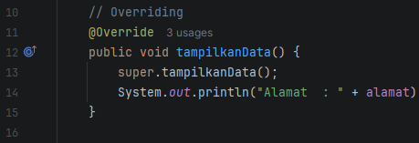
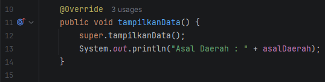
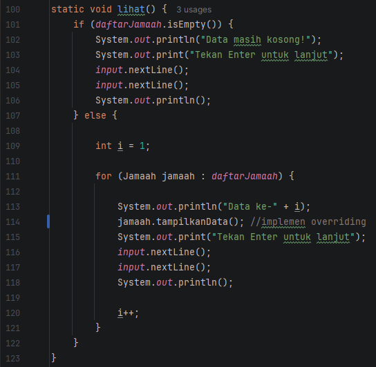
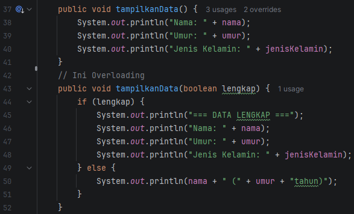

## LAPORAN POSTTEST 4 PRAKTIKUM PEMOGRAMAN BERBASIS OBJEK (PBO)
#### Nama: Richo Anan Rizky Putra   NIM: 2409106062   Kelas: B1 2024

### Deskripsi Posttest  
Pada posttest kali ini saya menggunakan Polymorphism berupa Overriding dan Overloading, Overriding saya gunakan pada Subclass,
sedangkan Overloading saya gunakan di Class Parent

### Polymorphism  
Polimorfisme dalam OOP merupakan sebuah konsep OOP di mana class memiliki
banyak “bentuk” method yang berbeda, meskipun namanya sama. Maksud dari “bentuk”
adalah isinya yang berbeda, namun tipe data dan parameternya sama. Polimorfisme juga
dapat diartikan sebagai teknik programming yang mengarahkan kamu untuk
memprogram secara general daripada secara spesifik

Polimorfisme pada Java memiliki 2 macam yaitu diantaranya:
1. Static Polymorphism (Overloading)
2. Dynamic Polymorphism (Overriding)

### Overriding
Pada program ini, overriding saya terapkan di subclass **JamaahMukim** dan **JamaahMusafir**. Keduanya override method
**tampilkanData()** dari class parent **Jamaah**

Tujuan overriding ini untuk memberikan perilaku yang berbeda pada method yang sama, contohnya:   - Class **Jamaah** hanya 
menampilkan data nama, umur, dan jenis kelamin  - Class **JamaahMukim** menambahkan alamat  - Class **JamaahMusafir** menambahkan asal daerah

Jadinya, meski method yang dipanggil sama, tapi hasil yang ditampilkan berbeda
   gambar subclass JamaahMukim  

   gambar subclass JamaahMusafir  

implementasi overriding digunakan pada Main.java pada menu "lihat()" 

### Overloading
Overloading pada program ini diterapkan pada class parent **Jamaah**, pada method tampilkanData()

Method tersebut memiliki 2 bentuk:
1. tampilkanData() -> menampilkan data lengkap
2. tampilkanData(boolean lengkap) -> menampilkan data berdasarkan parameter, jika bernilai _true_ menampilkan data lengkap,
jika bernilai _false_ menampilkan data dengan singkat  
  
Tujuan penggunaan Overloading ialah untuk memberikan variasi pemanggilan method

## Sekian dan Terima Kasih
