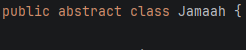
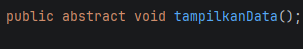
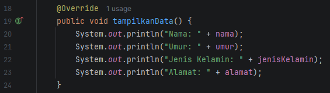
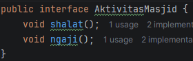
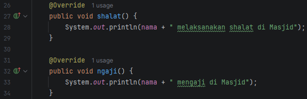
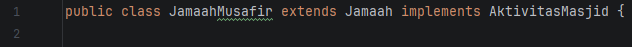
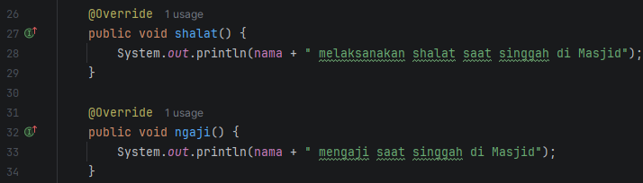

## LAPORAN POSTTEST 5 PRAKTIKUM PEMOGRAMAN BERBASIS OBJEK (PBO)
#### Nama: Richo Anan Rizky Putra   NIM: 2409106062   Kelas: B1 2024

### Deskripsi Posttest
Pada posttest kali ini, saya melanjutkan posttest sebelumnya dengan menerapkan Abstraction dan Interface

Perubahan utama yang dilakukan adalah mengubah class Jamaah yang sebelumnya merupakan class biasa menjadi abstract class, 
serta menambahkan abstract method yang diimplementasikan subclass. Selain itu, saya juga menambahkan sebuah 
interface yang berisi method terkait aktivitas jamaah di masjid, dan mengimplementasikannya pada subclass yang ada

### Abstraction
Abstraction merupakan sebuah proses yang digunakan untuk menyembunyikan detail implementasi atau proses kompleks suatu objek, 
dan hanya menampilkan fungsi esensial dan fungsional. Abstraction berfokus kepada apa yang dilakukan sebuah objek dibandingkan 
bagaimana objek itu melakukannya

- #### Abstract Class
      
saya mengubah class Jamaah yang sebelumnya class biasa menjadi abstract class yang dimana tidak bisa digunakan untuk membuat
objek, untuk memanggil abstract class diperlukan child class yang mengimplementasikan method abstract yang dibuat di abstract
class

- #### Abstract Method
      
Implementasinya di child class seperti ini:

- #### Interface
      

Interface adalah sebuah cara untuk menerapkan abstraction dengan membuat method tanpa menyertakan body methodnya

Untuk menggunakan interfacenya perlu menggunakan kata kunci "implement" di class, dan sama seperti abstract class, semua
method yang digunakan pada class harus di definisikan

Untuk penggunaan abstraction di Main tidak ada yang perlu **ditambahkan** maupun **diubah**

## Sekian dan Terima Kasih